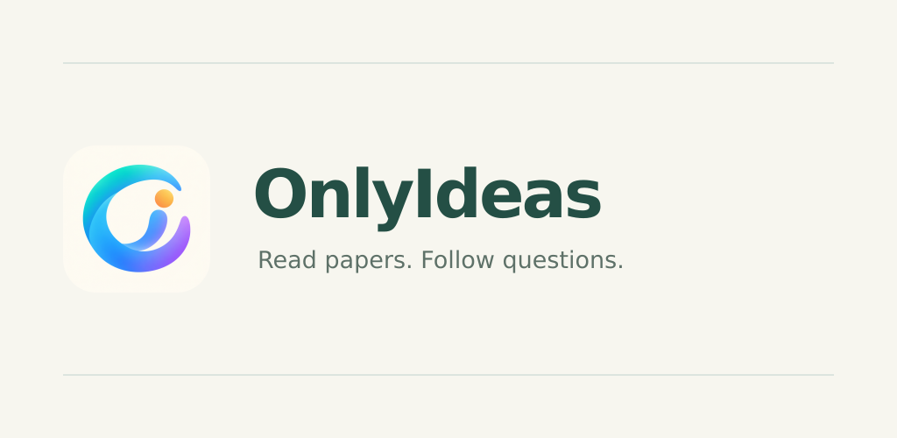

# Google Play banner correction · 8 October 2026

The live developer page already used the approved flowing icon for its small
app thumbnail. Its large feature graphic still contained the earliest green
logo. The feature graphic now embeds the same approved cyan/blue/violet artwork
with its gold dot and ivory background.

`store/google/feature.svg` references `icon.png`; the reproducible exporter
`node tools/native/export-play-feature.mjs` embeds that icon while rendering.
The full native icon exporter also invokes this step to avoid future banner
drift. Existing artwork masters and archived variants are preserved.

Validation: opaque 1024 × 500 PNG; visual inspection; exact pixel equality
between the local asset and Google's uploaded copy. `npm run check` passed all
174 tests plus renderer and production build checks, using the configured
Pandoc 3.11 path. No app binary or server was changed.

Play Console confirmed **1 change sent for review**, solely **Change Feature
graphic**. Publishing overview shows **Changes in review**, with quick checks
still running at capture. Managed publishing remains off. Build 27 remains an
internal candidate. Approval and public propagation are not yet verified.

## Policy URL check

Google's quick check reported unresolved DNS for the existing privacy and account
deletion pages on `lachlan.lazying.art/OnlyIdeasApp/`. Google Public DNS returned
NOERROR with the expected GitHub Pages CNAME and addresses. Both exact pages
returned HTTPS 200 with normal certificate verification when using those DNS
results. Their privacy and deletion content was read and verified. Ordinary
workstation resolution and some connections were intermittent.

The operator used Play Console's explicit **Proceed anyway** flow for those two
DNS findings after this verification. This does not claim that DNS was repaired
or that all resolver paths work. Policy URLs, page content and DNS configuration
were unchanged; a reviewer may still recheck accessibility.

Asset SHA-256:
`e32c4e93e7237f119e7cb3fb096fbf8a38cb231f6a9c2c9a89b2d18e9e1d5c75`.
Private Console and DNS evidence: `../Bunko/.runtime/play-artwork-20261008/`.
